# website-with-login
an old web technologies final assigment of mine!! i used mysql, html, css, php and a little bit js.

# Documentation (in Turkish)

# İNTERNET TEKNOLOJILERI VE WEB PROGRAMLAMA

PHP ve MYSQL ile Kullanıcı Girişli Web Sitesi Projesi

## Uygulamanın Genel Görünümü ve İlk İzlenimler

Öncelikle Uygulamamızın tasarımını kullanıcı girişi yapmadan tanıyalım

### Ana Sayfa

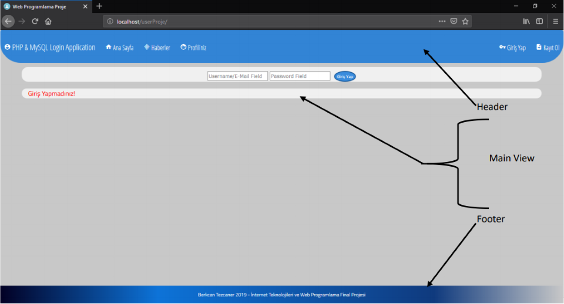

Uygulamamın genel yapısı 3 temel öğeden oluşuyor:

- Header: Kullanıcının sitede navigasyonunu sağlayan kullanışlı bar
    ▪ Sol Tarafında; Uygulama Logosu, Ana Sayfa, Haberler, Profil tuşlarını
    ▪ Sağ Tarafında; Giriş Yap, Kayıt Ol tuşlarını barındırıyor
    ▪ Main View’den hemen önce giriş diyaloğu
- Main View: Kullanıcılara göstereceğimiz içeriklerin bulunduğu bölge
- Footer: Kısa Bilgi

Şimdi bu alt menülerin içeriklerine bakalım

### Haberler

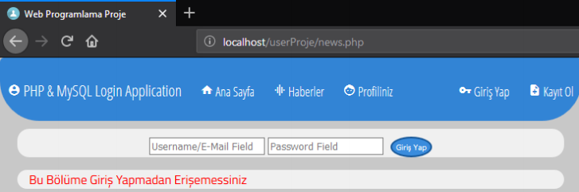

### Profiliniz

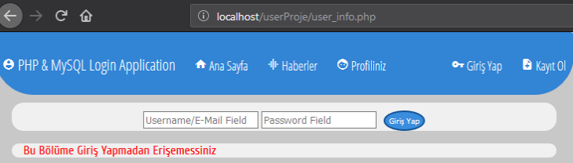

- Görüldüğü üzere giriş yapmamış kullanıcının erişim izni olmadığından içerikleri görüntüleyemiyor.
- Giriş Yap formu ise header’a bağlı olduğundan bütün sayfalarımızdan giriş yapabilme imkanı sağlıyor

### Kayıt Ol

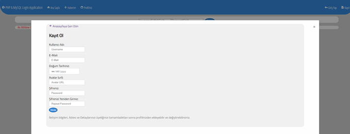

- Kullanıcının daha çabuk kayıt olabilmesi için ekstra bilgileri üyelik tamamlandıktan sonra girebileceğini
  belirtiyoruz


## Üyelik ve Kullanıcı Girişi

Kullanıcı üyeliği ve giriş sistemine geçmeden önce veritabanımız tanıyalım

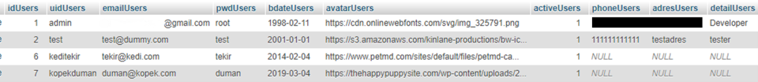

### Veritabanı

Users tablom

▪ **idUsers:** kullanıcıları idleri. Her yeni kullanıcı için bir önce yaratılan kullanıcının id’si+1 şeklinde
oluşur
▪ **uidUsers:** kullanıcının unique kullanıcı ismi. Başkasıyla paylaşılamaz
▪ emailUsers: eposta
▪ **pwdUsers:** kullanıcının şifresi
▪ **bdateUsers:** kullanıcının doğum günü. Date formatında saklanmakta
▪ **avatarUsers:** kullanıcının istediği profil resminin url’i
▪ **activeUsers:** kullanıcının aktiflik durumu. Kullanıcı hesabını dondurmaya karar verirse
kullanılacak
▪ **phoneUsers:** kullanıcının telefon numarası
▪ **adresUsers:** kullanıcının adresi
▪ **detailUsers:** kullanıcının kendisi hakkında girmek istediği bilgiler

Şimdi yeni bir kullanıcı oluşturalım;

### Üyelik Almak

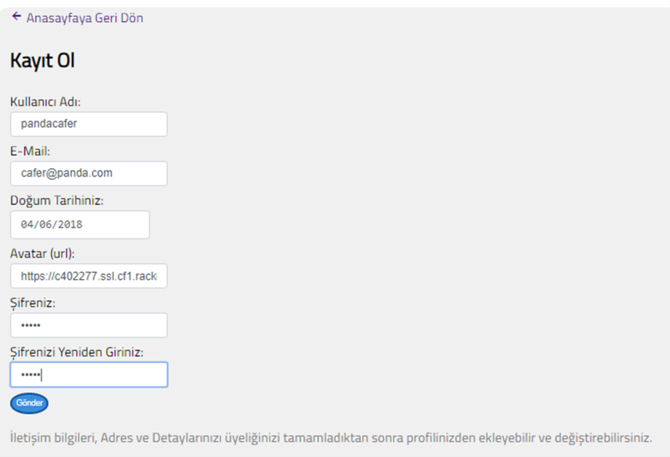

```
http://localhost/userProje/signup.php?signup=success
// başarılı giriş yapıldı
```

Adres çubuğunda başarılı mesajını gördükten sonra anasayfaya geri dönebiliriz. Fakat öncelikle yanlış
durumlara bakalım

```
http://localhost/userProje/signup.php?error=emptyfields&uid=&mail=
// Boş bırakılmış zorunlu alanlar var
```
```
http://localhost/userProje/signup.php?error=usertaken&mail=
// Kullanıcı ismi daha önce alınmış
```
```
http://localhost/userProje/signup.php?error=invaliduid&mail=cafer@cafer
// Eposta yanlış formatta
```
```
http://localhost/userProje/signup.php?error=passwordcheck&uid=&mail=
// İlk girilen şifreyle ikinci şifre tutmuyor
```

Bu fonksiyonlarımızın hepsi signup.in.php dosyasında tutuluyor:

### Giriş

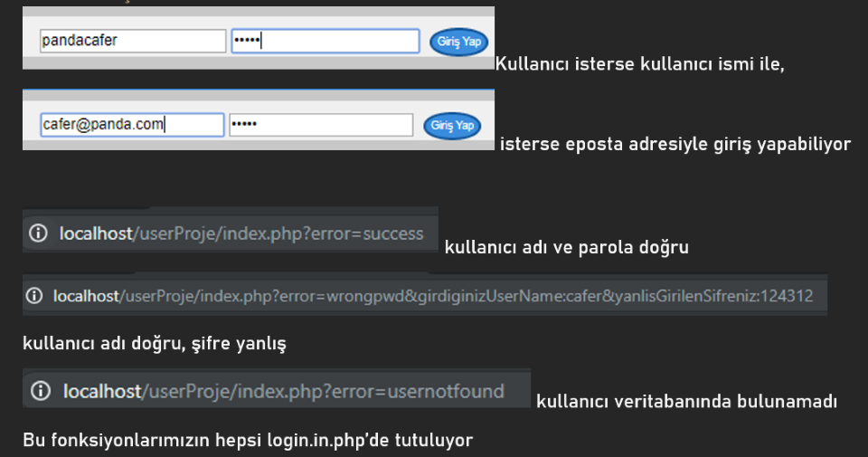


### Kullanıcının Gözünden Site

Kullanıcıyı karşılama ekranı ve giriş yapılması sonrasında göze çarpan değişiklikler

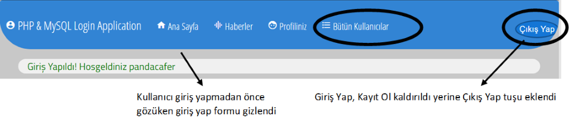

Şimdi ise daha önce erişim izni sağlayamadığımız bölgelere göz atalım

### Haberler

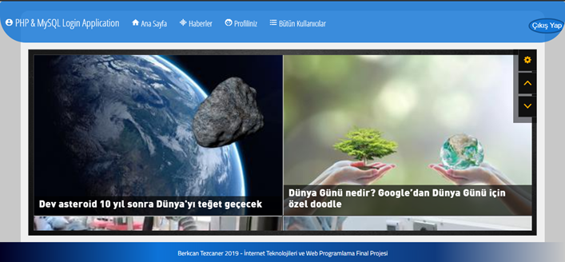

### Profiliniz

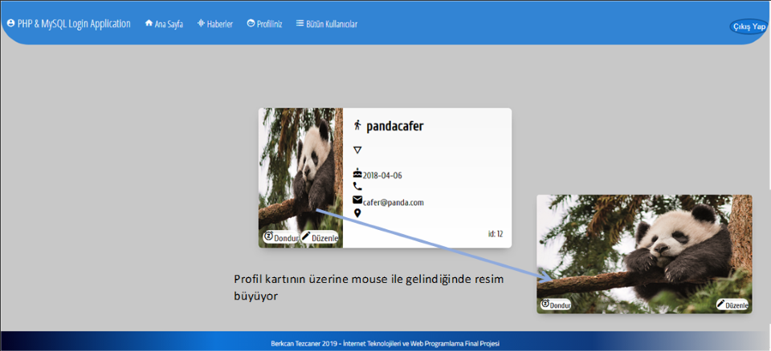

Şimdi sırasıyla “Düzenle” ve “Dondur” seçeneklerine bakalım

### Profili Düzenle

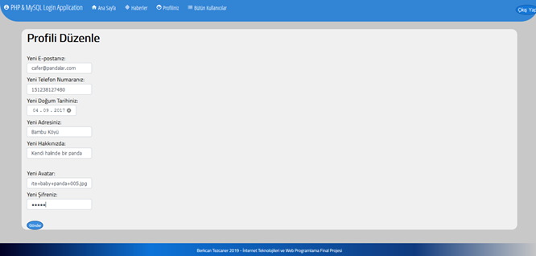

Profiliniz sayfasında yaptığımız değişiklikleri görelim

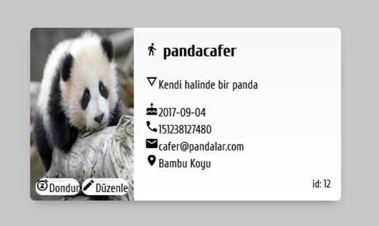

Görüldüğü üzere değişikliklerimiz veritabanına işlemiş.

### Hesabı Dondurma (Deaktif Etme)

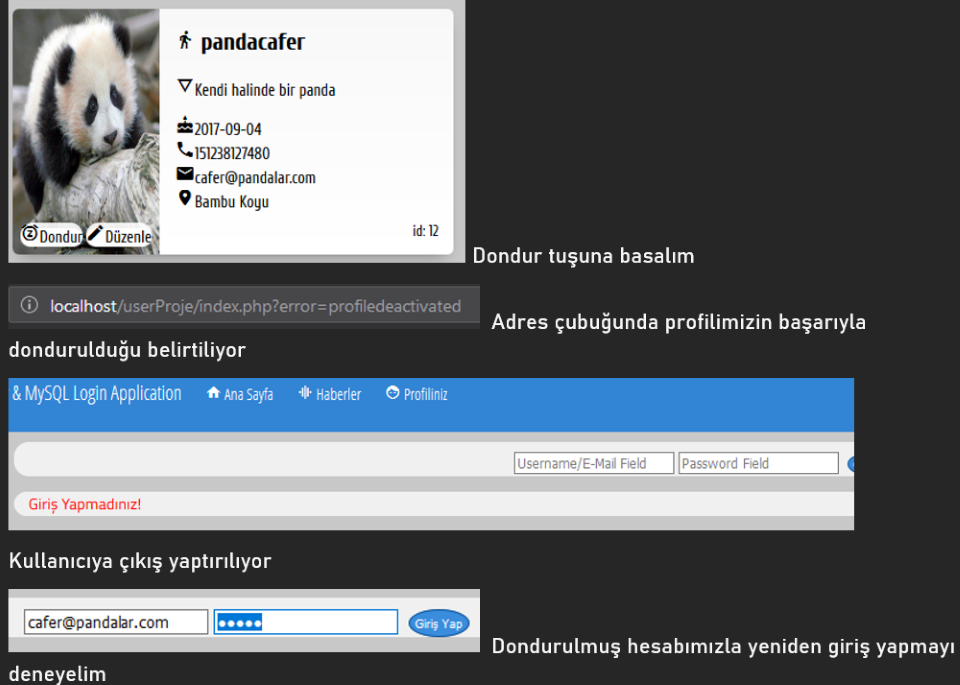

Kullanıcı web uygulamamızdan tamamen farklı bir arayüze sahip Profiliniz Aktif Değil sayfasına atıldı.
Dilerse Aktifleştir tuşuna basıp profilini aktif edebilir.

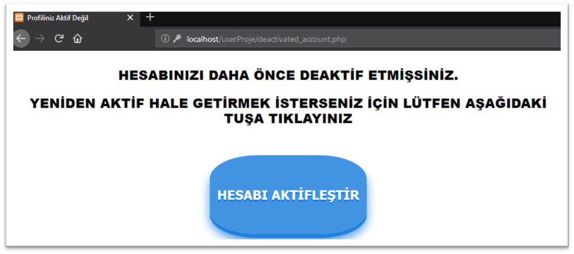

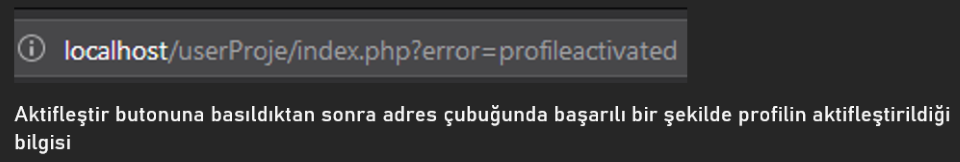

## Admin Paneli

### Bütün Kullanıcılar

Veritabanına kayıtlı bütün kullanıcıları listeleyen ve kaldırma imkanı sağlayan tablo

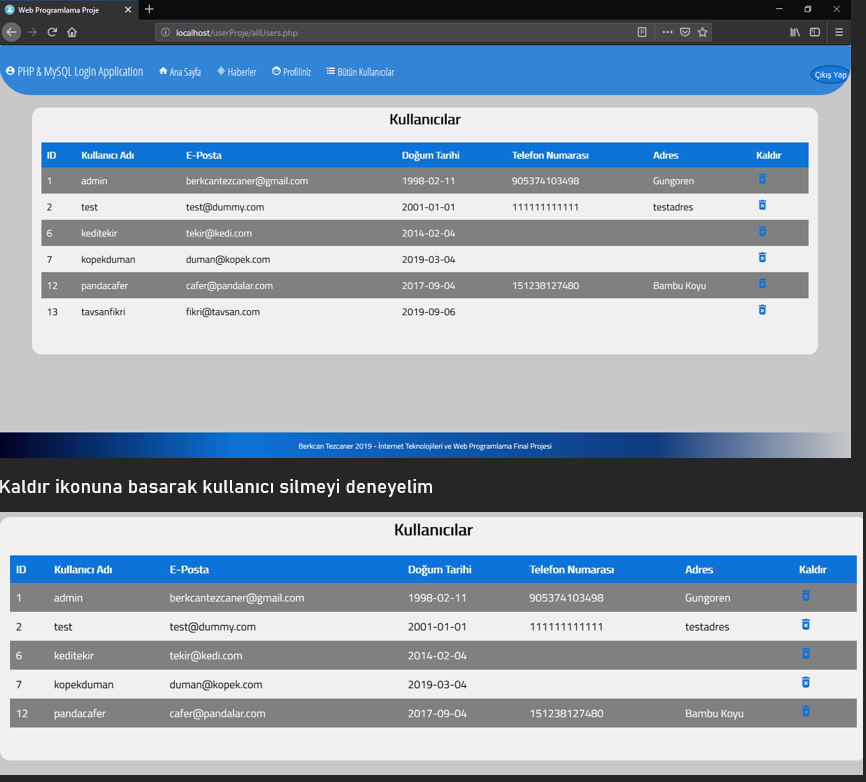

Görüldüğü üzere 13 idsine sahip kullanıcıyı kaldır ikonuna basarak veritabanından sildik
